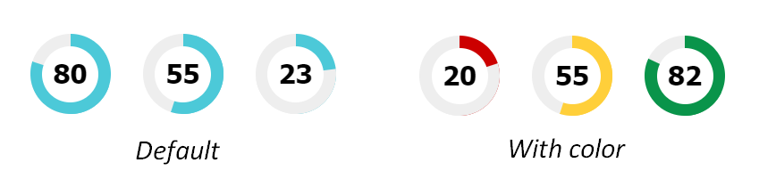

# CSS Progress Pie
This is a progress pie done in CSS. It came about when I needed a simple progress pie but didn't want to rely on any JS plugins as they took too long to load for a specific situation at work. I also felt that my CTO was going to strangle me if I introduce another JS plugin, especially one just for aethestic purposes :sweat_smile:.

## Examples

[See here for examples and use cases](https://oliviale.github.io/CSS-Progress-Pie/)




## How To Use
1. Download the CSS or SCSS file and include it in your `<head>`. 

There are two kinds - default (single color) or colored with red, yellow and green for the numbers 1 to 40, 41 to 70 and 71 to 100 respectively.
``` html
<link rel="stylesheet" href="css/progress_pie_compiled.css"/>
```
2. HTML structure with `data-value` being a number from 1 to 100.
``` html
<div class="progress-pie" data-value="50"></div>
<div class="progress-pie-color" data-value="80"></div>
```
3. Uh... that's it.


## Changing colors, fonts, etc.
Manually change the properties of the CSS code. [More details here](https://oliviale.github.io/CSS-Progress-Pie/#styling).

## Playground
[Play around in this Codepen](https://codepen.io/oliviale/pen/YqEgPw)

## License and other stuff
Do whatever you want license, but preferably do not delete the author comments in the CSS file :joy:.

Also, if you do end up using this and do wonderful things like you wonderful people always do, forking or tweeting your work at [me](http://twitter.com/meowlivia_) is appreciated.
